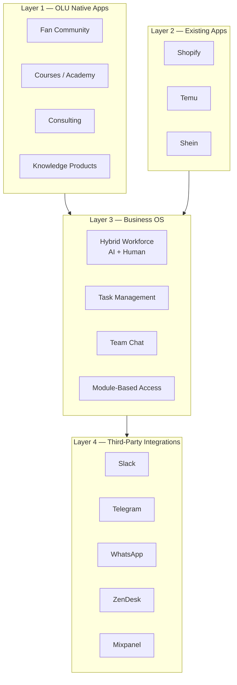
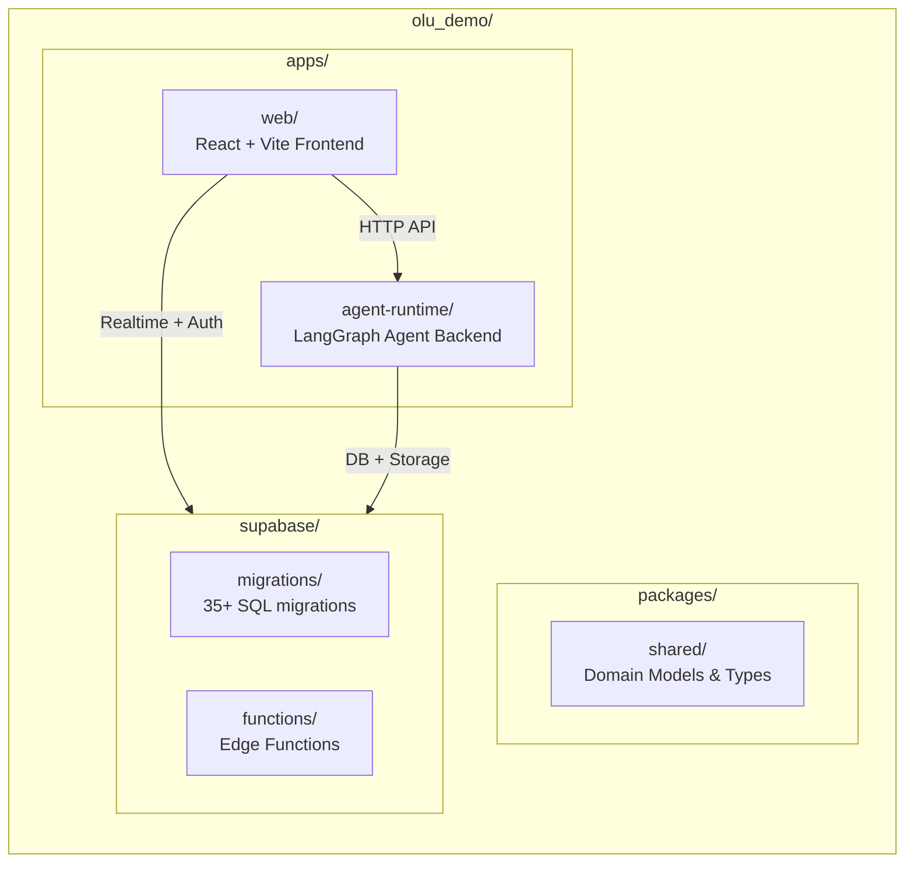
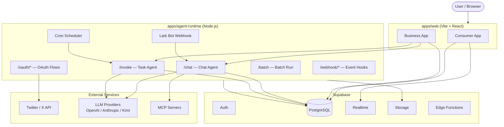
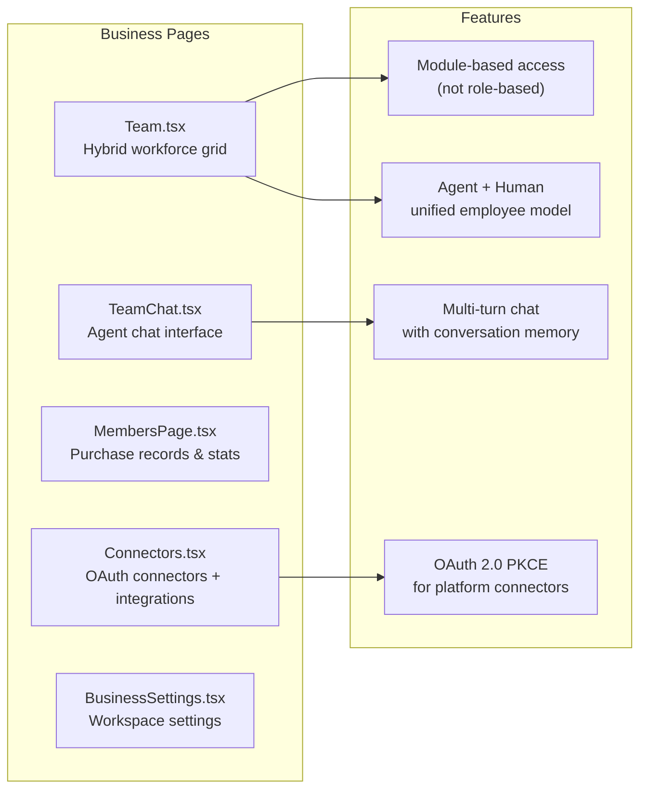
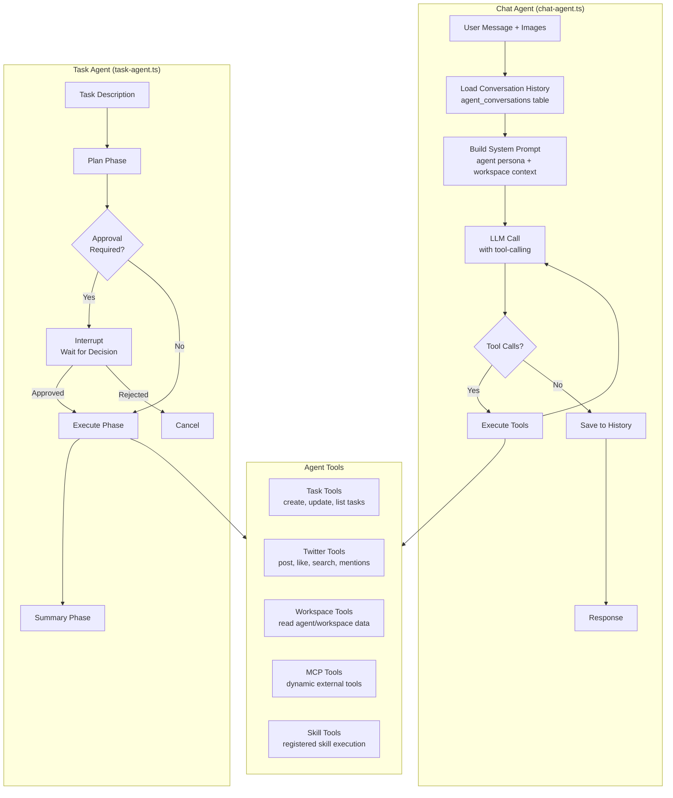
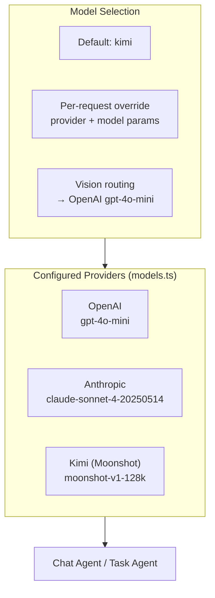
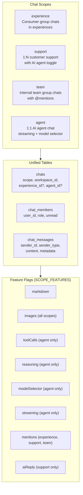
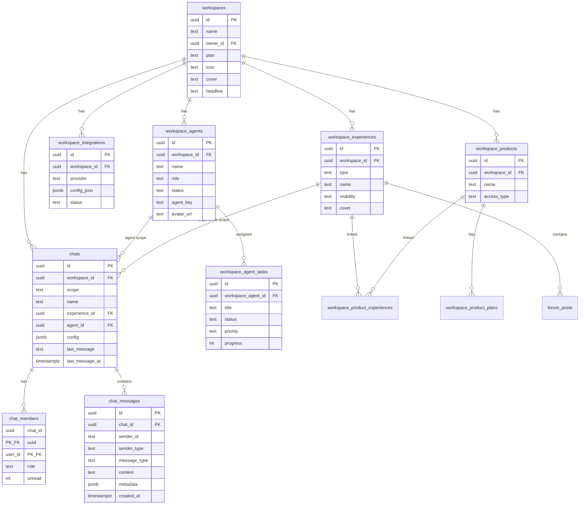
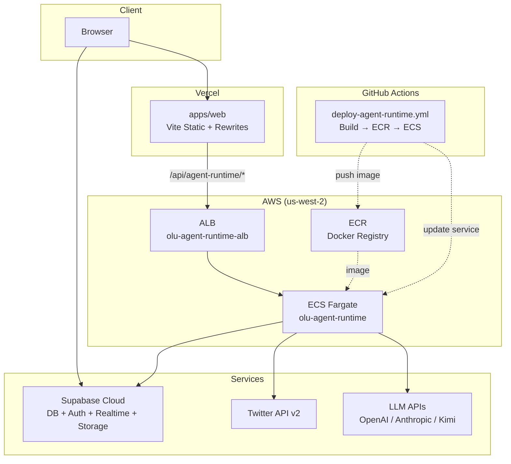

# OLU Platform Architecture

## Overview

OLU is a multi-tenant SaaS platform combining **consumer-facing native apps** with an **AI-Agent Business OS**. The platform uses an HR metaphor where AI agents and human employees share the same Employee model — position, JD, skills, qualifications, performance, and salary (token cost).

---

## Product Architecture (4 Layers)

---

## Monorepo Structure

---

## System Data Flow

---

## Frontend Domain Architecture

```mermaid
graph TD
  subgraph ConsumerApp["Consumer App (/consumer)"]
    D_CONSUMER["consumer/<br/>App config, templates"]
    D_SOCIAL["social/<br/>Posts, comments, likes"]
    D_PROFILE["profile/<br/>User profiles"]
  end

  subgraph BusinessApp["Business App (/business)"]
    D_TEAM["team/<br/>Agents + Humans (HR model)"]
    D_WORKSPACE["workspace/<br/>Multi-tenant workspaces"]
    D_EXPERIENCE["experience/<br/>Modular content (forum, course, chat)"]
    D_PRODUCT["product/<br/>Products, plans, purchases, home config"]
    D_CHAT["chat/<br/>Unified chat (4 scopes)"]
    D_CONNECTORS["connectors/<br/>Task targets (Twitter, Shopify...)"]
    D_INTEGRATIONS["integrations/<br/>Communication bridges"]
    D_CAMPAIGN["campaign/<br/>Marketing campaigns"]
    D_AGENT["agent/<br/>Re-exports from team/"]
  end

  subgraph SharedDomain["Shared"]
    D_AUTH["auth/<br/>Session & auth"]
  end

  subgraph Contexts["React Contexts"]
    CTX_SESSION["SessionContext"]
    CTX_WORKSPACE["WorkspaceContext"]
    CTX_CONSUMER["ConsumerContext"]
    CTX_APP["AppContext"]
  end

  D_AUTH --> CTX_SESSION
  D_WORKSPACE --> CTX_WORKSPACE
  D_CONSUMER --> CTX_APP
  ConsumerApp --> CTX_CONSUMER
  BusinessApp --> CTX_WORKSPACE
```

---

## Business App Pages

---

## Agent Runtime Architecture

---

## LLM Provider System

---

## Unified Chat System

All chat/messaging in OLU uses a single set of tables (`chats`, `chat_members`, `chat_messages`), differentiated by **scope**. Each scope enables a different subset of features via `SCOPE_FEATURES`.

### Chat Architecture

| Component | Path | Purpose |
|-----------|------|---------|
| `domain/chat/types.ts` | Types + `SCOPE_FEATURES` | `ChatScope`, `ChatMessage`, `ChatFeatures` |
| `domain/chat/api.ts` | Data layer | CRUD, realtime subscriptions, file upload |
| `components/ChatRoom.tsx` | Reusable chat UI | Used by consumer pages (GroupChatView, SupportChat) |
| `pages/TeamChat.tsx` | Business agent/team chat | Custom UI with model selector, budget cards, tool calls |
| `pages/SupportCenter.tsx` | Business support inbox | Lists support chats, per-agent assignment |

### RLS Strategy

Chat RLS uses `SECURITY DEFINER` functions to break recursion:

- `is_chat_member(chat_id, user_id)` — bypasses RLS on `chat_members`
- `is_workspace_owner(workspace_id, user_id)` — bypasses RLS on `workspace_memberships`

Workspace owners can see all chats in their workspace. Members can only see chats they belong to.

---

## Database Schema (Key Tables)

---

## Deployment Architecture

---

## Key Design Principles

| Principle | Implementation |
|-----------|---------------|
| **Full-stack TypeScript** | All apps and packages use TypeScript/Node.js |
| **Module-based access** | `enabledBusinessModules` controls feature access, not user roles |
| **HR metaphor** | AI agents and humans share `workspace_agents` — same fields, same management |
| **Domain-driven frontend** | 10 domains under `src/domain/`, each with own `api.ts`, `types.ts`, `hooks.ts` |
| **Separation of concerns** | Connectors (task targets) vs Integrations (communication bridges) |
| **Multi-tenant** | Workspace-scoped data isolation via Supabase RLS |
| **Unified chat** | Single `chats`/`chat_members`/`chat_messages` tables; 4 scopes (experience, support, team, agent) with feature flags |
| **OAuth delegation** | Workspace-level OAuth tokens for platform connectors (Twitter, etc.) |
